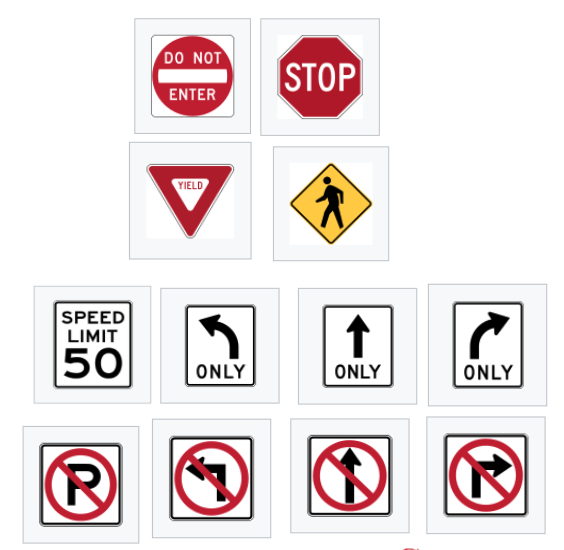
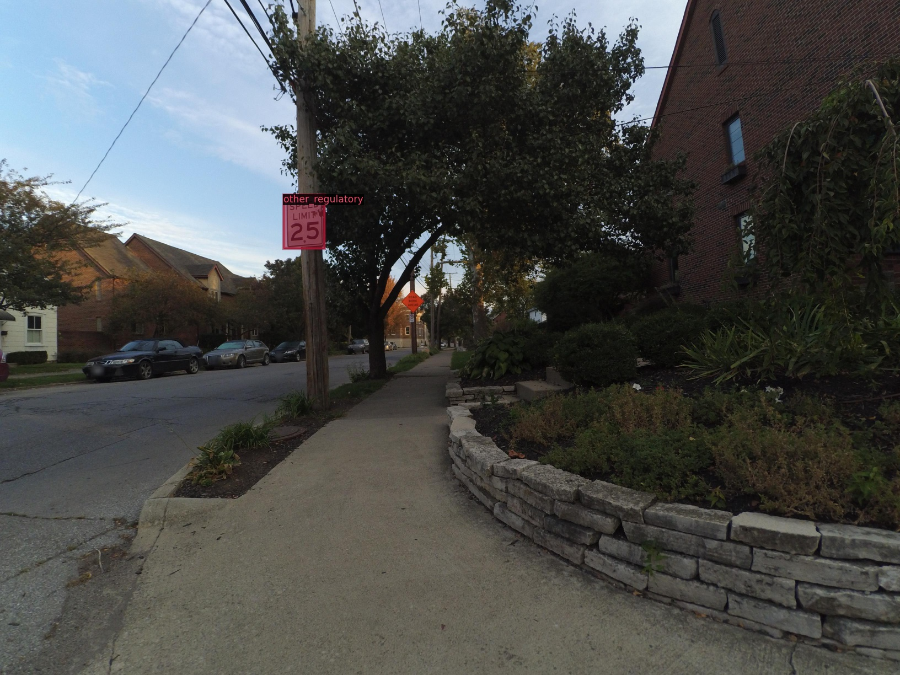

# Sign Detector

#### Build the detectorn2 dictionary file based on Mapillary Traffic Sign Dataset

1. Request the dataset: https://www.mapillary.com/dataset/trafficsign

2. Split the images and annotations based on the split files (provided in split_files)

   ```
   python split_imgs_anns.py --root_dir [root_dir_of_dataset] --path_to_img [path_to_store_imgs] --path_to_ann [path_to_store_annotations] --path_to_split_file [path_to_the_split_file]
   ```

3. Generate the annotation file in detectron2 format (Pre-defined 6 classes)

   ```
   python trafficsigns_to_detectron_6_class.py --path_to_img [path_to_splited_imgs] --path_to_ann [--path_to_splited_annotations] --path_to_pkl [path_to_the_annotation_file]
   ```

   

4. Test the annotation file

   ```
   python test_dict_6_class.py --path_to_pkl [path_to_the_annotation_file]
   ```
   
   


#### Test on the pre-build model

1. Set up the enviornment: 

   Use environment.yml to build the needed environement

   ```
   conda env create -f environment.yml
   ```

2. Download model weight:

   Download link: https://drive.google.com/drive/folders/1tF7upcJhw_5rtj11odlgaO4ZlW2AjMPn?usp=sharing

3. Test on images:

   Put the images in the test_imgs directory

   Excuete the script: 

   ```
   python test.py
   ```
   
   Example output result:
   
   


#### Generate .npz from a sequence

1. Download a test sequence from argoverse dataset: https://www.argoverse.org/data.html#tracking-link

2. Exuete the script to get .npz using the following command:

   ```
   python gen_npz.py --path_to_pkl [path_to_the_annotation_file] --path_to_model [path_to_the_trained_weights] ----path_to_seq [path_to_the_sequence] --output_dir [output_directory]
   ```

   Output .npz will be generated under $(output_dir)/record along with the generated output images in .mp4 format

#### Train the model

1. Set up the enviornment: 

   Use environment.yml to build the needed environement

   ```
   conda env create -f environment.yml
   ```

2. Train the model
   ```
   python train.py --path_to_pkl [path_to_the_annotation_file] --output_dir [output directory to store all the outputs]
   ```
3. Test on images:

   Put the images in the test_imgs directory

   Excuete the script: 

   ```
   python test.py
   ```

#### Run metrics on the model

1. Run metrics: 

   ```
   python metrics/validate_6.py --path_to_model [path to your model]
   ```

2. You can get the mAP for each class and the corresponding PR curve


